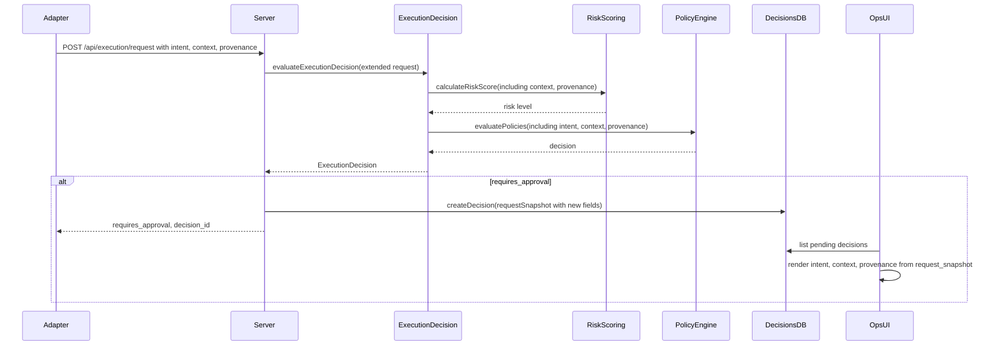

# PRD Review: Execution Context Signals for Safer Governance Decisions

## Verdict

The PRD is **well-scoped, backwards compatible, and aligned with Clasper’s governance flow**. The codebase has clear extension points (contract, policy engine, risk scoring, decision snapshot, ops UI). A few discrepancies and design choices need to be resolved before implementation.

---

## Current State (Verified Against Codebase)

### 1. Adapter contract and execution request

- **[contracts/adapter.openapi.yaml](contracts/adapter.openapi.yaml)** – `ExecutionRequest` has: `execution_id`, `adapter_id`, `tenant_id`, `workspace_id`, `skill_id?`, `requested_capabilities`, `estimated_cost?`. No `intent`, `context`, or `provenance`.
- **[src/lib/adapters/executionContract.ts](src/lib/adapters/executionContract.ts)** – TypeScript interface and Zod `ExecutionRequestSchema` match the OpenAPI shape.

### 2. Server API vs OpenAPI

- **POST `/api/execution/request**` in [src/server/index.ts](src/server/index.ts) (around 1590) validates the body with `**ExecutionDecisionRequestSchema**` (defined in the same file, ~1439). That schema is **stricter and larger** than the OpenAPI `ExecutionRequest`:
  - **Required:** `tool_count` (number).
  - **Optional:** `environment`, `adapter_risk_class`, `max_steps`, `max_cost`, `tool_names`, `skill_state`, `temperature`, `data_sensitivity`, `skill_tested`, `skill_pinned`, `custom_flags`, `rbac_allowed`, `callback_url`, `override`.
- So the **HTTP API already accepts more than the documented adapter contract**. Existing adapters that only send the OpenAPI fields would fail validation today unless they also send `tool_count` (e.g. from a control plane that enriches the request).

**Recommendation:** Decide whether the PRD’s “ExecutionRequest” is (a) the **public adapter contract** (OpenAPI-only, minimal), or (b) the **current server payload**. If (a), the server should accept adapter-style requests without `tool_count` (e.g. default `tool_count` to `requested_capabilities.length` or `0`) so “existing adapters unchanged” holds. If (b), document the full server schema as the contract and add `intent`/`context`/`provenance` there.

### 3. Policy engine

- **[src/lib/policy/policyEngine.ts](src/lib/policy/policyEngine.ts)** – `PolicyContext` has: `tenant_id`, `workspace_id`, `environment`, `tool`, `adapter_id`, `adapter_risk_class`, `skill_state`, `risk_level`, `estimated_cost`. No `intent`, `context`, or `provenance`.
- **[src/lib/policy/policySchema.ts](src/lib/policy/policySchema.ts)** – `PolicyConditionsSchema` is flat: `adapter_risk_class`, `tool`, `skill_state`, `risk_level`, `min_cost`, `max_cost`, `tenant_id`, `workspace_id`. No `capability`, `context.*`, or `provenance.*`.
- Policy matching uses `scopeMatches`, `subjectMatches`, and `conditionsMatch`; conditions are simple equality/cost bounds. The PRD’s example (`capability: shell.exec`, `context.external_network: true`, `provenance.source: marketplace`) requires **new condition keys and possibly nested/dotted handling**.

### 4. Risk scoring

- **[src/lib/governance/riskScoring.ts](src/lib/governance/riskScoring.ts)** – `RiskScoringInput` includes `requestedCapabilities` and `adapterRiskClass`; used in `calculateAdapterRisk`. There is no use of `external_network`, `elevated_privileges`, or provenance. Adding these is a small, localized change.

### 5. Decision flow and storage

- **[src/lib/governance/executionDecision.ts](src/lib/governance/executionDecision.ts)** – `evaluateExecutionDecision` builds an internal request and calls `calculateRiskScore` and `evaluatePolicies`. It does **not** pass through intent/context/provenance today; those would need to be added to `ExecutionDecisionRequest` and threaded into both risk and policy.
- **[src/lib/governance/decisions.ts](src/lib/governance/decisions.ts)** – `createDecision` stores `requestSnapshot` as JSON (request + decision). So **any new request fields (intent, context, provenance) are persisted automatically** once they are accepted by the server and passed into the snapshot. No DB schema change required for the snapshot itself.

### 6. Ops UI – approval list

- **[src/ops-ui/app.js](src/ops-ui/app.js)** (around 920–945) – Renders pending decisions from `decision.request_snapshot` (e.g. `snapshot.decision`, `snapshot.request`). It shows: `decision_id`, `adapter_id`, `execution_id`, `required_role`, `expires_at`, matched policies, decision trace, explanation. It does **not** show intent, context, or provenance. Phase 2 can read `snapshot.request.intent`, `snapshot.request.context`, `snapshot.request.provenance` and display them in the approval card.

---

## PRD Alignment Summary

- **Optional `intent`, `context`, `provenance` on ExecutionRequest**: Fits cleanly. Add to OpenAPI, `executionContract.ts`, and the server schema.
- **Policy match on `intent`, `context.*`, `provenance.***`: Partial fit. Requires extending `PolicyContext`, `PolicyConditionsSchema`, and `conditionsMatch()`. PRD example also implies a new `capability` match.
- **Risk scoring uses context/provenance**: Fits. Extend `RiskScoringInput` and add increments for `external_network`, `elevated_privileges`, and `provenance.source`.
- **Approval UX shows intent/context/provenance**: Fits. Decision `request_snapshot` already stores the request; ops UI can render new fields.
- **Telemetry & audit**: Fits. New fields can be included in decision snapshots and optionally called out in decision trace/audit events.
- **Backwards compatibility**: Achievable because all new fields are optional; no migrations needed.

---

## Gaps and Clarifications

### 1. Policy condition shape for “capability” and nested keys

PRD example:

```yaml
deny:
  when:
    capability: shell.exec
    context.external_network: true
    provenance.source: marketplace
```

- **Capability:** Today there is no `capability` condition. Options: (a) add a single `capability` condition (e.g. “match if `requested_capabilities` contains this value”), or (b) a list `capabilities` with “any”/“all” semantics. Recommend (a) for v2.3.
- **Nested keys:** Current conditions are flat. You need either:
  - **Dotted keys in conditions:** e.g. `context.external_network: true`, `provenance.source: marketplace` with the engine resolving paths into the request/context object, or
  - **Nested objects in schema:** e.g. `conditions.context: { external_network?: boolean }`, `conditions.provenance: { source?: string }`.

Recommend defining a small, explicit schema for `context` and `provenance` in policy conditions (and in `PolicyContext`) so validation and matching stay simple.

### 1.1. Define “unknown” semantics precisely (so policy behavior is predictable)

The PRD says missing fields are treated as **unknown**. In implementation terms:

- **Match rule**: a condition on a field matches only if the request field is **present** and equals the condition.
- **Missing booleans**: missing does **not** equal `false`; it is “unknown” and should not match `true` or `false`.
- **Acting on unknown**: support it explicitly (either via `*_unknown` condition flags or a simple `require_known` flag) so policies can express “must declare X for shell.exec”.

### 2. “False declarations” and violations

PRD: “False declarations are treated as violations if detected.” There is no current path that compares declared `context` (e.g. `writes_files`) to actual behavior. Implementing that would require post-execution checks (e.g. comparing to trace/audit). Treat this as **out of scope for Phase 1** and document as a future enforcement mechanism.

### 3. Contract version

PRD labels the change as v2.3. OpenAPI `info.version` is currently `v1`. Plan to bump the contract version when shipping (e.g. to `v2` or `v2.3`) and document adapter compatibility.

### 4. Default for missing context/provenance

PRD: “Missing fields are treated as **unknown**.” Policy and risk logic must explicitly handle “field absent” (e.g. do not treat as `false` for booleans). Policies that want to “deny when unknown” need a clear rule (e.g. “deny when `context.external_network` is not `true` and not `false`”).

---

## Implementation Plan (Phased)

### Phase 1 – Schemas and data flow

1. **Contract and types**
  - In [contracts/adapter.openapi.yaml](contracts/adapter.openapi.yaml): Add optional `intent` (string), `context` (object with `external_network`, `writes_files`, `elevated_privileges`, `package_manager`, `targets`), `provenance` (object with `source` enum, `publisher`, `artifact_hash`). Keep all new fields optional.
  - In [src/lib/adapters/executionContract.ts](src/lib/adapters/executionContract.ts): Add the same optional fields to the `ExecutionRequest` interface and `ExecutionRequestSchema` (Zod).
  - In [src/server/index.ts](src/server/index.ts): Extend `ExecutionDecisionRequestSchema` with optional `intent`, `context`, `provenance` (same structure).
    - **Backcompat fix (recommended)**: make `tool_count` optional and default it (recommended default: `0`) so OpenAPI-style requests remain valid and “existing adapters unchanged” is true in practice.
    - If you keep requiring `tool_count`, update the OpenAPI contract to reflect that requirement.
  - In [src/lib/governance/executionDecision.ts](src/lib/governance/executionDecision.ts): Add optional `intent`, `context`, `provenance` to `ExecutionDecisionRequest` and pass them through to risk and policy.
2. **Policy engine**
  - In [src/lib/policy/policySchema.ts](src/lib/policy/policySchema.ts): Extend `PolicyConditionsSchema` with:
    - `capability?: string` meaning “request `requested_capabilities` contains this value”.
    - `intent?: string` exact match.
    - `context?: { external_network?: boolean; writes_files?: boolean; elevated_privileges?: boolean; package_manager?: string; targets?: string[] }`.
    - `provenance?: { source?: 'marketplace' | 'internal' | 'git' | 'unknown'; publisher?: string; artifact_hash?: string }`.
    - Optional explicit “unknown” controls (`*_unknown` or `require_known`) if desired (see 1.1).
  - In [src/lib/policy/policyEngine.ts](src/lib/policy/policyEngine.ts): Extend `PolicyContext` with optional `requested_capabilities`, `intent`, `context`, `provenance`. In `conditionsMatch`, implement:
    - `capability`: `ctx.requested_capabilities?.includes(conditions.capability)`.
    - `context`/`provenance`: for each condition field that is set, require the corresponding ctx field is present and equals it (missing = unknown, does not match).
3. **Risk scoring**
  - In [src/lib/governance/riskScoring.ts](src/lib/governance/riskScoring.ts): Add to `RiskScoringInput` optional `context?: { external_network?: boolean; elevated_privileges?: boolean }` and `provenance?: { source?: string }`. In `calculateRiskScore`, add factors (or adjust existing) to increase score when `external_network === true`, `elevated_privileges === true`, or `provenance.source === 'marketplace'`. Document weights and keep them tunable.
4. **Decision snapshot and audit**
  - No schema change needed: `requestSnapshot` already stores the full request. Optionally include in audit events or decision_trace that context/provenance were used (e.g. which policy matched on context).

### Phase 2 – UX and documentation

1. **Ops UI – approval view**
  - In [src/ops-ui/app.js](src/ops-ui/app.js): When rendering a decision card, read `snapshot.request.intent`, `snapshot.request.context`, `snapshot.request.provenance` and display a short summary (e.g. “Intent: install_dependency”, “External network: yes”, “Writes files: yes”, “Source: marketplace”) so approvers have the PRD-described context.
2. **Docs and examples**
  - Adapter integration guide: how to send `intent`, `context`, and `provenance` for high-risk capabilities.
  - Policy examples: YAML snippets for deny/require_approval using `capability`, `context.*`, `provenance.*`.
  - Optional: “Recommended context keys” and policy templates for `shell.exec`.

### Phase 3 (optional)

1. **Recommended context keys** and policy templates as described in the PRD.

---

## Data flow (after implementation)




---

## Summary

- **PRD is implementable and fits the codebase.** Main work: extend OpenAPI and TS types, extend policy conditions and matching, add risk factors, and surface new fields in the ops approval UI.
- **Resolve:** Adapter contract vs server schema (and `tool_count` default), and exact policy condition shape (capability + nested vs dotted for context/provenance).
- **Defer:** “False declaration” detection and enforcement to a later phase.
- **Version:** Bump adapter contract version when shipping (e.g. v2 or v2.3).

